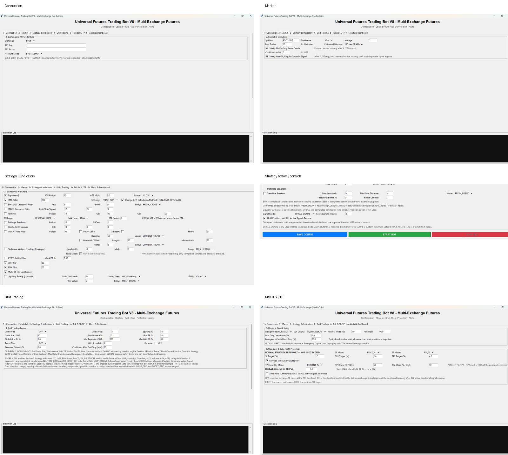

# Universal Futures Trading Bot V8.2

A Python/Tkinter multi-exchange cryptocurrency futures trading bot for development, testing, research and educational use.

> **Important:** This project is not financial advice and does not guarantee profits. Cryptocurrency futures and leverage can cause rapid losses. Start with demo/testnet environments and understand your exchange's order, account-mode and liquidation rules.

## 🚀 V8.2 Modular Engine + Recovery + Multi-Bot Build

**Current build — V8.2.5**

`UniversalFuturesBot_V8_2_4_AUDITED_STRATEGY_ENGINE.py`

`UniversalFuturesBot_V8_2_MODULAR_ENGINE.py` remains available as the earlier V8.2 baseline.

This build keeps the existing V8 strategy/Grid architecture and adds the V8.1 safety/regression layer and adds a persistent recovery layer, exchange-side reconciliation, isolated bot profiles, and a shared multi-bot trade/session ledger.

### Highlights

- Multi-exchange futures execution through CCXT
- Completed-candle strategy evaluation
- **17 configurable directional modules**
- DIRECT_SHOT and SCORE strategy execution
- LONG_GRID / SHORT_GRID / NEUTRAL_GRID
- NEUTRAL_GRID automatic direction changes
- Grid basket TP and global Grid SL
- Grid exposure and drawdown controls
- Global daily drawdown and emergency capital-loss protection
- Individual Grid order-status verification
- **Crash/restart recovery with Resume or Start New prompt**
- **Per-bot profile configuration and runtime state**
- **Saved Bot Profile Manager with profile table, full details and Copy Profile**
- **Copy Profile workflow for cloning a bot to another pair/quantity/leverage**
- **Exchange-side position/order reconciliation before recovery**
- **Profile locking to prevent duplicate instances of the same bot profile**
- **Shared SQLite master database for multiple bots**
- **Excel-compatible master CSV trade/session export**
- Telegram alerts
- Dashboard and CSV trade logging

## 🆕 V8.2.4 Strategy + Execution Audit — 2026-09-20

### Added
- **ANY_NON_CONFLICTING** signal mode: any enabled directional module may trigger when the final direction is not contradictory.
- Explicit conflict blocking: EMA=BULL + VWAP Delta=BEAR remains **NO TRADE** in ANY_NON_CONFLICTING.
- `StrategyEngine.decision_reason()` for deterministic signal diagnostics.
- Per-module signal-state logging and explicit decision reasons.
- Configuration schema version 5.

### Fixed
- `2_SIGNALS`, `3_SIGNALS` and `4_SIGNALS` now enforce their named confirmation count inside the central StrategyEngine.
- Invalid saved signal modes fall back safely to `SINGLE_SIGNAL`.
- Worker-thread trade-limit and max-drawdown shutdown paths no longer call the Tkinter-touching `stop_bot()` method.
- Persisted schema values use the central schema constants.

### Modified
- The signal log now shows states such as `EMA_CROSS:BULL,VWAP_DELTA:BEAR`, the required confirmation count and the decision reason.
- Existing Grid, recovery, profile, SL/TP and protection architecture is retained.
- The V8.2.3 runtime symbol normalization fix remains included.

### Validation
- Python compilation: PASS.
- GUI attribute/callback audit: PASS.
- Save/load coverage audit: PASS.
- V8.2.4 regression tests: **12/12 PASS** locally.
- Full live exchange lifecycle: not claimed by this audit.

See **[V8.2.4 Release Notes](docs/V8_2_4_RELEASE_NOTES.md)** and **[V8.2.4 Audit Tests](tests/test_v824_audit.py)**.
## 🆕 V8.2.5 Strategy-Parity Backtester

The V8.2.5 backtester was built from the uploaded V8.2.4 live engine plus the previously supplied V8 multi-strategy backtester reference.

### Backtester coverage
- All 17 live directional modules: ST, EMA, EMA Cross, MACD, RSI, Bollinger, Stochastic, VWAP, VWAP Delta, VIDYA, NWE, Liquidity Swings, Trendline, MTF, Volume, ADX, ATR.
- Every live indicator option/entry mode.
- Central signal modes: SINGLE_SIGNAL, ANY_NON_CONFLICTING, SCORE, 2_SIGNALS, 3_SIGNALS, 4_SIGNALS, STRICT_ALL_FILTERS.
- Normal risk sizing, cooldown, same-candle protection, max trades, daily DD and emergency capital-loss stop.
- PRICE_% / ROI_% protection, TP1/TP2 split, TP1 break-even, Hold-All-Reverse and post-SL opposite-signal lock.
- DIRECT_SHOT, LONG_GRID, SHORT_GRID and NEUTRAL_GRID with Grid risk/protection controls.
- Multi-symbol public OHLCV, caching, CSV/XLSX export, monthly statistics, equity data, parameter sweep, walk-forward and 1/2/3/4-way combination lab.
- V8 bot-config JSON import/export.

### Important V8.2.5 fix
The live Grid validator requires Global Grid SL to be greater than Grid Spacing × Grid Levels. The previous default was 5.0% SL with 5 × 1.0% levels, which fails its own validator because 5.0 is equal to 5.0. The live default is now 6.0%.

### Historical execution model
Signals use completed candles and normal entries are simulated at the next candle OPEN. If an OHLC candle touches both SL and TP, the backtester assumes SL first. Funding, liquidation, order-book latency and exchange-specific conditional-order behavior are not invented.
## 🆕 What was fixed / added / modified

### 1. Crash / restart recovery

The previous V8 runtime state was primarily in memory. The new build persists a per-profile runtime checkpoint.

When the application detects a previous running/crashed/stopping session, it asks:

> **Resume the last saved bot stage?**

You can choose:

- **YES — Resume:** restore saved configuration/runtime state and verify it against the exchange.
- **NO — Start New Bot:** start a new session without silently adopting an existing exchange position/order.

The recovery state includes strategy mode, timeframe, module summary, session statistics, normal-position state, protection IDs, TP1/BE state, re-entry locks and Grid state.

### 2. Exchange-side recovery verification

Resume does not blindly trust the local state file.

Before continuing, the bot verifies the exchange-side position and open-order state and uses the saved bot state to determine whether the inventory can safely be associated with the profile.

Unknown/unverifiable states are handled conservatively instead of being silently treated as safe.

### 3. Full configuration recovery

The running configuration is checkpointed so recovery can restore the settings that were active for the session, including strategy, risk, execution and Grid parameters.

API keys, API secrets and Telegram credentials are deliberately excluded from the crash-recovery snapshot.

### 4. Multi-bot profiles

Each bot can have a unique **Bot Profile ID**, for example:

```text
BOT-01 → BTC/USDT → 15m
BOT-02 → ETH/USDT → 5m
BOT-03 → SOL/USDT → 1h
```

Each profile has isolated configuration and runtime-state files under:

```text
bot_profiles/
    BOT-01/
        config.json
        runtime_state.json
    BOT-02/
        config.json
        runtime_state.json
```

A profile lock prevents two processes from accidentally running the same profile simultaneously.

### 5. Master multi-bot trade/session database

All profiles can write to:

```text
universal_bot_master.db
```

The master ledger records bot/session context such as:

- Bot Profile ID
- Session ID
- Exchange
- Account mode
- Symbol
- Timeframe
- Strategy mode
- Grid mode
- Signal mode
- Enabled strategy modules
- Side
- Entry/exit information
- Quantity
- Leverage
- SL / TP1 / TP2
- TP1 state
- PnL/session result
- Duration
- Exit reason
- Configuration hash

### 6. Saved Bot Profile Manager

The Connection tab now includes a profile table showing saved bots with Profile ID, Exchange/account mode, Pair, Timeframe, Leverage, Strategy/Grid mode, Quantity or risk mode, Runtime status and Last update.

Selecting a profile opens a detailed configuration view. API keys, API secrets and Telegram tokens are masked in the details panel.

**Copy Selected Profile** creates an independent profile with the same strategy, risk, Grid, exchange and credential settings. The copied runtime checkpoint is reset. You can then change Pair, Quantity/Risk and Leverage before saving and starting the second bot.

### 6.1 Profile Load / Save / Copy Improvements

The Profile Manager also strengthens the existing profile loading and saving workflow:

- **Load Selected Profile** loads the saved configuration into the GUI.
- Before loading, existing Tkinter Entry fields are cleared so values such as API keys, secrets, symbol and other text fields cannot be accidentally concatenated during repeated profile loads.
- Loading a **nonexistent profile is blocked** instead of leaving an older profile's settings visible.
- **Save Profile** writes the current profile configuration to its own profile storage.
- **Copy Selected Profile** creates a new Bot Profile ID with the source strategy, indicators, risk, Grid, exchange and credential configuration.
- The copied profile's previous runtime checkpoint is reset, so it does not inherit the source bot's recovery session.
- After copying, the new profile can be changed independently for **Pair, Quantity/Risk and Leverage**, then saved and started.
- While a bot is running, **Profile ID, Exchange, Account Mode and active Symbol** cannot be silently changed through a live configuration checkpoint.
- Profile locking prevents the same Bot Profile ID from being started by another process at the same time.
- Profile lock acquisition occurs only after API credential validation, preventing a failed credential check from leaving a stale profile lock.

This section describes the configuration/profile changes made in the **V8 Profile Manager + Configuration Audit — 2026-09-20** update.

### 6.2 V8.2.2 Profile Manager Selection Fix

V8.2.2 fixes a UI state mismatch between the Connection-section Profile ID field and the Saved Bot Profiles tree:

- **Load Profile ID** loads the exact Profile ID typed in the Connection section.
- **Delete Profile ID** deletes the exact Profile ID typed in the Connection section.
- **Load Selected** loads the profile selected in the Profile Manager table.
- **Delete Selected** deletes the profile selected in the Profile Manager table.
- After deleting the current profile, the GUI synchronizes to the first remaining saved profile so the visible selection and Profile ID field cannot silently refer to different profiles.

This prevents the confusing situation where BOT-02 is visibly selected but a top-level action still attempts to load BOT-01.

### 7. Excel-compatible master log

The database is accompanied by:

```text
universal_bot_master_log.csv
```

The CSV can be opened directly in Microsoft Excel for comparing multiple bot profiles, pairs, timeframes and strategy configurations.

### 8. Protection reconciliation safety improvement

Protection reconciliation now distinguishes verified exchange states from uncertain states. If protection cannot be safely verified, the recovery/execution path fails closed rather than guessing.

### 9. Existing Grid duplicate-order protection retained

The previous V8 Grid fix remains in this build. The Grid engine tracks managed order IDs and individually verifies missing orders rather than recreating levels from an incomplete open-order snapshot.

### 10. Bugs fixed during configuration/profile audit

The current audited build also fixes repeated profile loads concatenating Entry-widget values, loading a nonexistent profile while leaving previous settings visible, changing Profile ID/exchange/account mode/active symbol through a live checkpoint, and acquiring a profile lock before API credential validation.

The audit also confirmed that all 115 GUI setting attributes are assigned before use, callbacks resolve to existing methods, and the saved configuration covers the current settings system.

### 11. Previous protection-reconciliation fix

The previous protection reconciliation implementation contained an undefined `open_ids` reference in a branch that could be reached during reconciliation. The audited build removes that undefined-variable dependency and uses the existing specific-order verification path.

### 12. V8.1 Engine / Strategy / Configuration Safety Audit

The V8.1 pass rechecked the execution engine, strategy decision path, settings variables, defaults, callbacks, profile configuration and recovery behavior.

#### Fixed

- Profile-lock startup ordering: API credentials are validated before lock acquisition.
- Recovery position identity: an open exchange position must match saved position/active-trade identity before recovery can adopt it.
- Recovery protection gate: a saved live position without a protection checkpoint is blocked.
- Immediate recovery protection reconciliation: a resumed normal position is reconciled immediately.
- One-way position safety: multiple live positions returned for one symbol are treated as unsafe and the engine refuses to guess.
- Bybit order consistency: normal market entry and normal emergency close explicitly use positionIdx=0.
- Trendline validation: breakout buffer is constrained to 0% <= buffer < 100%.
- Generic trigger safety: generic CCXT trigger orders check reported triggerPrice/reduceOnly capabilities when available and fail closed on explicit unsupported results.
- Profile identity integrity: the profile folder remains authoritative if config.json contains a stale/mismatched bot_id.
- Configuration schema: saved profiles now carry config_schema_version=3.

#### Modified

- Signal voting was extracted into a pure _decide_signal() engine helper. Existing SINGLE_SIGNAL, SCORE/2/3/4_SIGNALS and STRICT_ALL_FILTERS behavior is preserved while the core decision path becomes independently regression-testable.
- Existing 17-module strategy, Grid, SL/TP, recovery and Profile Manager architecture is preserved.

#### Added

- tests/test_v81_static_audit.py with 10 automated checks covering Python compilation, GUI variable assignment, callback resolution, save/load coverage, profile-lock ordering, recovery safety, one-way position protection, trendline bounds, schema versioning and signal-voting behavior.

#### V8.1 validation

- Python compilation: PASS
- Static engine/configuration audit: PASS
- V8.1 regression checks: 10/10 PASS
- Full exchange order lifecycle: NOT LIVE-TESTED in this audit

V8.1 remains intended for demo/testnet validation before live funds are used.

## 🧩 V8.2 Modular Engine

V8.2 keeps the existing execution/recovery architecture but separates the final strategy-voting contract into a GUI/exchange-independent StrategyEngine. The GUI remains the execution coordinator and the existing 17 directional modules continue to feed the same decision path.

Additional V8.2 hardening:

- Central supported-exchange, signal-mode and Grid-mode contracts.
- Preflight validation runs before profile-lock acquisition or exchange-side mutations.
- Invalid signal mode, minimum score, leverage and Grid settings are rejected early.
- CCXT client timeout is set to 20 seconds to prevent an indefinitely blocked network call from freezing a worker cycle.
- Configuration schema is version 4; runtime checkpoint schema is version 3.
- V8.2 regression tests cover compilation, GUI attributes, callback resolution, strategy voting, recovery contracts and Grid fail-closed behavior.

## 🧠 17 directional modules

The V8 Section 3 strategy engine can use:

1. Supertrend
2. EMA
3. EMA Cross
4. MACD
5. RSI
6. Bollinger Bands
7. Stochastic
8. VWAP
9. VWAP Delta
10. Volumatic VIDYA
11. NWE
12. Liquidity Swings
13. Trendline Breakout
14. Multi-Timeframe
15. Volume
16. ADX
17. ATR

The Grid SCORE logic uses the same enabled Section 3 directional modules and their configured parameters.

## 📊 Strategy modes

### DIRECT_SHOT

Direct strategy execution using the configured signal engine.

### SCORE

Combines directional module votes into a bullish/bearish score and requires the configured minimum score.

### Grid modes

- **LONG_GRID** — buy-side Grid
- **SHORT_GRID** — sell-side Grid
- **NEUTRAL_GRID** — automatic direction based on the configured direction source

## 🔄 NEUTRAL_GRID automatic direction

NEUTRAL_GRID can automatically change Grid direction:

- **SUPERTREND** — follows the current Supertrend direction.
- **SCORE** — uses the complete enabled Section 3 directional-module score.
- **OFF** — uses the complete Section 3 score logic in the supplied V8 build.

When direction changes, the Grid engine cancels old pending entries, handles existing Grid inventory, verifies the position state before switching sides, resets the Grid center and places the new side.

LONG_GRID and SHORT_GRID remain explicitly directional and are not automatically switched by this mechanism.

## 🛠️ Grid duplicate-order fix

One of the important V8 engineering fixes addresses a Grid synchronization problem.

The engine does not rely only on an incomplete open-order snapshot to decide whether a tracked Grid order still exists. It:

1. Retrieves Bybit open orders with an explicit page size.
2. Tracks locally managed order IDs.
3. Checks missing tracked IDs individually with order-status queries.
4. Retains orders when their status is still open or ambiguous.
5. Removes or marks orders according to their verified exchange status.
6. Verifies managed cancellations individually.

This is intended to prevent repeated recreation of Grid levels when an exchange response does not contain every open order.

## 🖥️ V8 GUI Preview



## 📖 Documentation

- **[User Manual](docs/UniversalFuturesBot_V8_User_Manual.pdf)**
- **[Change Log](CHANGELOG.md)**
- **[Recovery / Multi-Bot / Profile Manager Audit](docs/V8_RECOVERY_MULTI_BOT_AUDIT.md)**
- **[Bot Profile Manager Guide](docs/PROFILE_MANAGER.md)**
- **[Launch Kit](docs/LAUNCH_KIT.md)**
- **[Contributing Guide](CONTRIBUTING.md)**
- **[Security Policy](SECURITY.md)**

## 🏗️ Architecture

```text
Tkinter GUI
    │
    ├── Market / Strategy Configuration
    ├── Indicator Parameters
    ├── Risk & Grid Configuration
    └── Monitoring / Dashboard
            │
            ▼
     Strategy Engine
            │
            ├── 17 Directional Modules
            ├── DIRECT_SHOT / SCORE
            └── Grid Engine
                    │
                    ▼
              Recovery Layer
                    │
          ┌─────────┴─────────┐
          ▼                   ▼
   Profile Runtime       Master Ledger
          │                   │
          ▼                   ▼
       CCXT              SQLite + CSV
          │
   ┌──────┼───────────┬───────────┐
   ▼      ▼           ▼           ▼
 Bybit  Binance    Gate.io     Bitget / WEEX
```

The current design supports Bybit, Binance, Gate.io, Bitget and WEEX. KuCoin is not included in this V8 build.

## ⚡ Quick start

### 1. Clone the repository

```bash
git clone https://github.com/vtejas1982-spec/Universal-Futures-Trading-Bot.git
cd Universal-Futures-Trading-Bot
```

### 2. Install dependencies

Python 3.13/3.14 is recommended for the current Windows development environment.

```powershell
py -m pip install -r requirements.txt
```

### 3. Configure credentials locally

Never commit exchange API keys, API secrets, Telegram tokens, passwords or private configuration files.

Keep credentials outside Git. See [SECURITY.md](SECURITY.md).

### 4. Run the current build

```powershell
py UniversalFuturesBot_V8_2_4_AUDITED_STRATEGY_ENGINE.py
```

### 5. Test recovery safely

Start with **one profile and demo/testnet credentials**.

Recommended first recovery test:

1. Start BOT-01.
2. Allow it to create its normal/Grid state in the controlled environment.
3. Stop/terminate the process in a controlled test.
4. Reopen the application.
5. Confirm the **Resume / Start New** prompt.
6. Choose Resume.
7. Confirm exchange-side reconciliation before execution continues.
8. Verify that no duplicate Grid orders are created.

## 🔬 Development and testing

The published recovery build was syntax-compiled and statically audited for configuration coverage, callbacks, persistence paths and the existing strategy modules.

The local audit also checked:

- GUI setting save/load coverage
- strategy-module configuration coverage
- runtime persistence
- profile locking
- master SQLite logging
- master CSV export
- recovery serialization
- protection reconciliation paths

### Not live-tested

This release has **not** been fully live-tested against Bybit Demo or every supported exchange. Exchange-side recovery, order-mode behavior, account modes and permissions can vary.

Do not interpret static validation as proof of safe live trading.

## 🗑️ V8.2.1 Profile Delete

V8.2.1 adds safe profile deletion to the Profile Manager. A profile cannot be deleted while it is running, locked by another bot process, or has recovery state that may represent an open/unverified position or active Grid orders. BOT-01 legacy configuration is handled explicitly, while the master SQLite trade/session history is preserved.

## 🧪 V8.2 validation status

- Local static/unit regression suite: **22 tests passed; 1 exchange-demo gate skipped**.
- Exchange demo/testnet order lifecycle: **not yet executed by the static suite**.
- V8.2 is intended to be validated on one exchange demo/testnet profile before live use.

## 🗺️ Roadmap

### V8 — current

- [x] 17 directional modules
- [x] DIRECT_SHOT / SCORE execution

### V8.2.4 audited strategy/execution build
- Added ANY_NON_CONFLICTING and explicit signal-decision diagnostics.
- Enforced 2/3/4 confirmation semantics inside StrategyEngine.
- Fixed worker-thread shutdown paths that called Tkinter-touching stop_bot().
- Added 12 regression checks covering strategy conflict handling, confirmation counts, configuration coverage and worker shutdown safety.

### V8.2.3 checkpoint fix
- Fixed live configuration checkpoint false warnings caused by comparing GUI symbols such as `OP/USDT` with CCXT canonical runtime symbols such as `OP/USDT:USDT`.
- The running symbol is now normalized through the connected exchange before the live identity check.
- Real symbol changes while running remain blocked.
